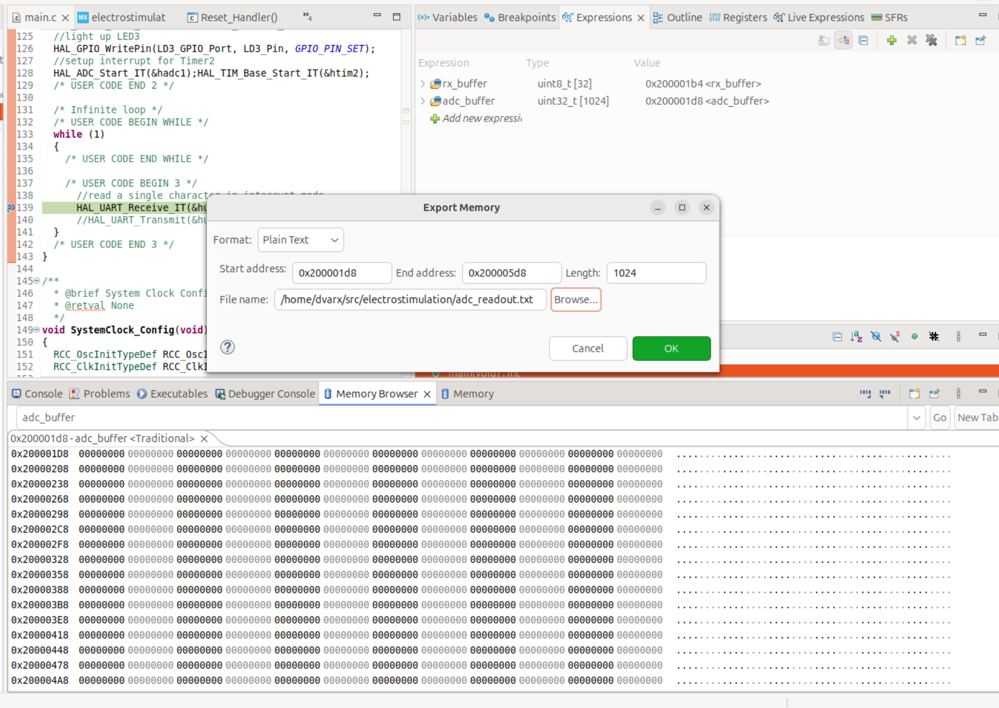

#Electrostimulation Project

##Commands
###Frequency Command
The frequency command is used to set the frequency of the PWM signal. It has the following format:

`FREQ\0XXXXXXXX\n`

where `XXXXXXXX` describes the desired frequency in mHz.

##Export data from STM32 CubeIDE Debugger
- Display the memory browser `Windows`->`Show View`->`Memory Browser`
- Export the data as shown below and use `plot_memory_buffer.py` to visualize the data
